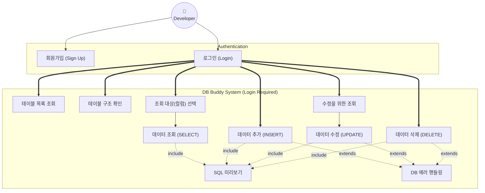
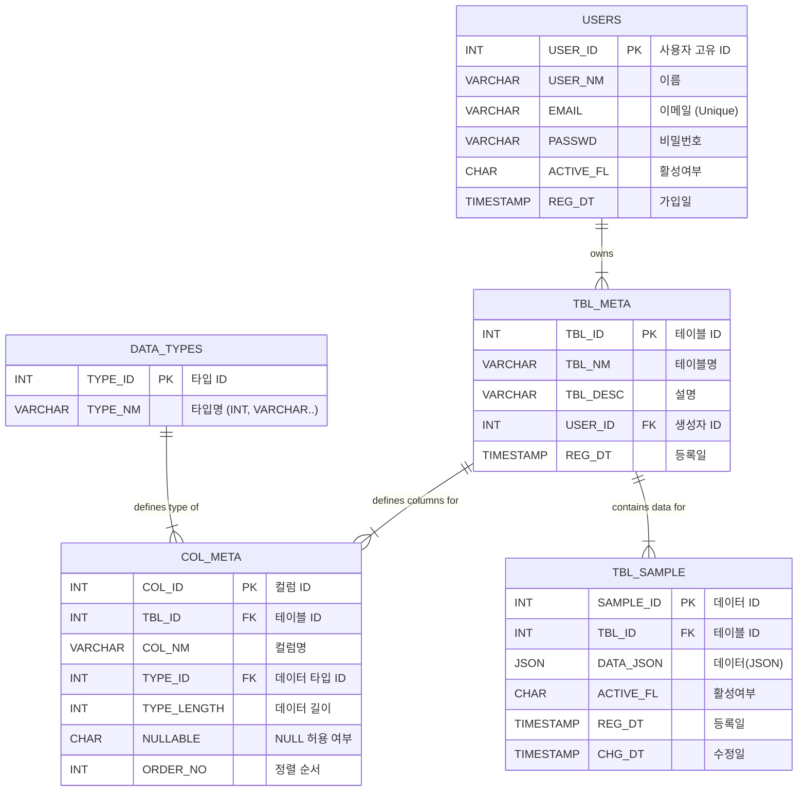
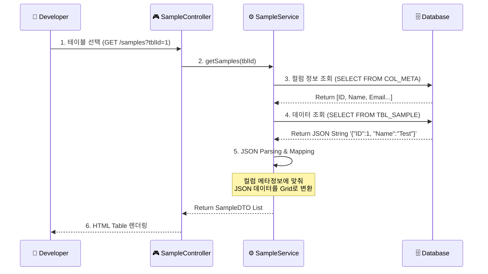
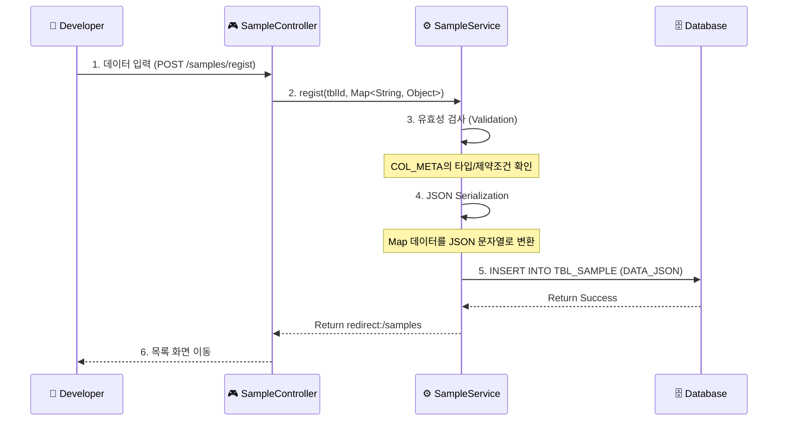

# 목차 (Table of Contents)
1. [프로젝트 소개](#-프로젝트-소개-project-introduction)
    - [1️⃣ 프로젝트 개요](#1️⃣-프로젝트-개요)
    - [2️⃣ 팀원 구성](#2️⃣-팀원-구성-team-composition)
    - [🛠️ 개발 환경](#�️-개발-환경-tech-stack)
2. [기획](#-기획-planning)
    - [3️⃣ 요구사항 상세](#3️⃣-요구사항-상세-requirements-specification)
    - [4️⃣ 시스템 설계](#4️⃣-시스템-설계)
        - [3.1 유스케이스](#31-유스케이스-use-case)
        - [3.2 ERD](#32-erd-entity-relationship-diagram)
        - [3.3 DDL](#33-ddl-data-definition-language)
        - [3.4 스키마 관리 흐름](#34-스키마-관리-흐름-schema-management-flow)
        - [3.5 데이터 처리 흐름](#35-데이터-처리-흐름-data-processing-flow)
3. [개발자 가이드](#-개발자-가이드-developer-guide)
    - [5️⃣ 프로젝트 진행 전략](#5️⃣-프로젝트-진행-전략)
    - [6️⃣ 트러블슈팅](#6️⃣-트러블슈팅-db-연결-문제-해결)

---

# �📌 프로젝트 소개 (Project Introduction)

## 프로젝트 이름
**DB Buddy**

---

## 1️⃣ 프로젝트 개요

**GUI 기반 CRUD 학습용 웹 DBMS**

이 프로젝트는 SQL 문을 직접 작성하지 않아도, 버튼과 입력폼을 통해 CRUD(Create, Read, Update, Delete)를 수행하고, 내부에서 어떤 SQL이 실행되는지 직관적으로 확인할 수 있는 교육용 웹 도구입니다.

- **목표**: SQL 문 구조와 DB 동작 원리를 직관적으로 이해
- **특징**: SQL 직접 입력 X / 안전한 범위 내 CRUD / GUI 기반

## 2️⃣ 팀원 구성 (Team Composition)

| 이름 | 역할 | GitHub | Email |
|:---:|:---:|:---:|:---:|
| **정진호** | **팀장** | [fdrn9999](https://github.com/fdrn9999) | [ckato9173@gmail.com](mailto:ckato9173@gmail.com) |
| **김태형** | 팀원 | [ikth-kim](https://github.com/ikth-kim) | [ikth.kim@gmail.com](mailto:ikth.kim@gmail.com) |
| **윤성원** | 팀원 | [SungWon180](https://github.com/SungWon180) | [yseongwon851@gmail.com](mailto:yseongwon851@gmail.com) |
| **정병진** | 팀원 | [wjdqudwls](https://github.com/wjdqudwls) | [wjdqdwls100@gmail.com](mailto:wjdqdwls100@gmail.com) |
| **최현지** | 팀원 | [choihyeonji00](https://github.com/choihyeonji00) | [as124ff2@gmail.com](mailto:as124ff2@gmail.com) |

## 🛠️ 개발 환경 (Tech Stack)

| 구분 | 상세 내용 |
|:---:|:---|
| **OS** | Windows |
| **Language** | Java 17 |
| **Framework** | Spring Boot 3.5.9 |
| **Build** | Gradle |
| **Database** | MariaDB |
| **ORM** | MyBatis 3.0.5 |
| **Frontend** | Thymeleaf, HTML5, CSS3, JavaScript |
| **Tool** | IntelliJ IDEA |

---

# 📌 기획 (Planning)

## 3️⃣ 요구사항 상세 (Requirements Specification)

### 3.1 기능 요구사항 (Functional Requirements)

시스템이 제공해야 하는 핵심 기능을 3단계 계층(대분류 > 중분류 > 소분류)으로 상세화했습니다.

| ID | 대분류 | 중분류 | 소분류 | 요구사항 명 | 상세 내용 및 검증 기준 (Acceptance Criteria) |
|:---:|:---:|:---:|:---:|:---|:---|
| ID | 대분류 | 중분류 | 소분류 | 요구사항 명 | 상세 내용 및 검증 기준 (Acceptance Criteria) |
|:---:|:---:|:---:|:---:|:---|:---|
| **FR-001** | **회원** | 계정 | 가입 | **회원가입** | - 사용자 이름(2~20자), 이메일, 비밀번호(8자 이상)를 입력받아 계정을 생성한다.<br>- **[검증 실패]** 이메일 형식 미준수 시 "올바른 이메일 형식이 아닙니다" 출력.<br>- **[검증 실패]** 이미 가입된 이메일 입력 시 "이미 존재하는 계정입니다" 메시지 출력.<br>- **[성공]** 가입 완료 시 로그인 페이지로 이동한다. |
| **FR-002** | **회원** | 계정 | 인증 | **로그인** | - 이메일과 비밀번호로 시스템에 접속한다.<br>- **[검증 실패]** 존재하지 않는 이메일이거나 비밀번호 불일치 시 "아이디 또는 비밀번호를 확인해주세요" 출력.<br>- **[예외 처리]** 이미 로그인된 상태에서 로그인 페이지 접근 시 메인 화면으로 리다이렉트.<br>- **[세션]** 로그인 성공 시 `JSESSIONID`가 발급되어야 한다. |
| **FR-003** | **스키마** | 테이블 | 관리 | **테이블 생성** | - 테이블 이름(영문/숫자/언더바, 최대 50자)과 설명을 입력하여 정의한다.<br>- **[검증 실패]** 특수문자나 공백이 포함된 테이블명 입력 시 에러 처리.<br>- **[검증 실패]** 동일한 이름의 테이블이 이미 존재할 경우 "이미 존재하는 테이블명입니다" 출력.<br>- **[성공]** 생성 직후 왼쪽 사이드바 또는 테이블 목록에 즉시 표시되어야 함. |
| **FR-004** | **스키마** | 테이블 | 조회 | **테이블 목록** | - 사용자가 생성한 테이블 목록만 필터링하여 조회한다.<br>- **[보안]** `TBL_META`, `COL_META`, `USERS` 등 시스템 테이블은 절대 노출되지 않아야 한다.<br>- **[보안]** 다른 사용자가 만든 테이블은 목록에 포함되지 않아야 한다 (`USER_ID` 필터링 필수). |
| **FR-005** | **스키마** | 컬럼 | 관리 | **컬럼 추가** | - 컬럼명(영문/숫자, 최대 50자), 데이터 타입(INT/VARCHAR/DATE 등), NULL 허용 여부를 설정한다.<br>- **[검증 실패]** 해당 테이블 내에 이미 존재하는 컬럼명 입력 시 에러.<br>- **[검증 실패]** 예약어(예: `SELECT`, `FROM`)를 컬럼명으로 사용 시도시 경고.<br>- **[성공]** 추가된 컬럼이 데이터 입력 폼에 즉시 Input Field로 생성되어야 함. |
| **FR-006** | **스키마** | 컬럼 | 관리 | **컬럼 수정** | - 기존 컬럼의 이름, 타입, 정렬 순서 등을 변경한다.<br>- **[영향도]** 컬럼명을 변경하면 기존에 저장된 JSON 데이터의 Key는 변경되지 않으므로, 데이터 조회 시 **기존 데이터가 누락되어 보일 수 있음**을 인지해야 함(또는 마이그레이션 전략 필요).<br>- **[검증]** 컬럼 순서 변경 시 조회 Grid의 열 순서가 즉시 변경되어야 함. |
| **FR-007** | **스키마** | 컬럼 | 관리 | **컬럼 삭제** | - 특정 컬럼을 메타 정보에서 영구적으로 제외한다.<br>- **[검증]** "이 컬럼을 삭제하면 더 이상 데이터를 볼 수 없습니다. 계속하시겠습니까?" 컨펌 메시지 필수.<br>- **[예외]** PK로 지정된 컬럼은 삭제할 수 없다. |
| **FR-008** | **데이터** | 조회 | 필터 | **조회 대상 선택** | - Grid에 표시할 컬럼을 체크박스로 선택한다.<br>- **[기능]** '전체 선택/해제' 기능 제공.<br>- **[검증 실패]** 아무 컬럼도 선택하지 않고 조회 시 "최소 하나 이상의 컬럼을 선택해주세요" 경고.<br>- **[결과]** 선택 해제된 컬럼은 `SELECT` 절에서 제외되어 결과 테이블에 렌더링되지 않아야 함. |
| **FR-009** | **데이터** | 조회 | 실행 | **데이터 조회** | - 선택된 테이블 및 컬럼 조건에 맞춰 데이터를 조회한다.<br>- **[UX]** 데이터가 0건일 경우 "데이터가 존재하지 않습니다" 문구를 테이블 중앙에 표시.<br>- **[성능]** 데이터가 많을 경우 페이징(Pagination) 처리 (한 페이지당 10건/20건). |
| **FR-010** | **데이터** | 조작 | 추가 | **데이터 추가** | - 동적으로 생성된 입력 폼을 통해 데이터를 저장(INSERT)한다.<br>- **[검증 실패]** `VARCHAR(50)` 컬럼에 50자 초과 데이터 입력 시 "입력 가능한 길이를 초과했습니다" 에러.<br>- **[검증 실패]** 숫자만 입력 가능한 필드(`INT`)에 문자 입력 시 유효성 에러. |
| **FR-011** | **데이터** | 조작 | 수정 | **데이터 수정** | - 기존 데이터를 불러와 값을 변경(UPDATE)한다.<br>- **[검증]** PK 컬럼(`SAMPLE_ID` 등)은 수정 불가(`disabled` 또는 `readonly`) 처리되어야 함.<br>- **[검증]** 수정 폼 진입 시 기존 데이터가 Input Field에 올바르게 채워져(Binding) 있어야 함. |
| **FR-012** | **데이터** | 조작 | 삭제 | **데이터 삭제** | - 특정 Row를 삭제(DELETE)한다.<br>- **[검증]** 삭제 버튼 클릭 시 브라우저 Confirm 창("정말 삭제하시겠습니까?") 출력.<br>- **[결과]** 취소 시 아무런 동작도 하지 않아야 하며, 확인 시 목록에서 해당 행이 즉시 사라져야 함. |
| **FR-013** | **유틸리티** | SQL | 시각화 | **SQL 미리보기** | - 수행되는 CRUD 작업에 해당하는 실제 SQL 쿼리를 화면에 표시한다.<br>- **[상세]** `INSERT INTO TBL_SAMPLE (DATA_JSON) VALUES ('{"COL": "VAL"}')` 형태가 아니라, 논리적 쿼리 `INSERT INTO [TABLE] ([COL]) VALUES ([VAL])` 형태로 변환하여 보여줄 것.<br>- **[UI]** 쿼리문은 복사(Copy)는 가능하되 수정은 불가능해야 함. |

### 3.2 비기능 요구사항 (Non-Functional Requirements)

품질, 보안, 사용성 등 시스템의 전반적인 제약 사항 및 기준입니다.

| ID | 대분류 | 중분류 | 소분류 | 요구사항 명 | 상세 내용 및 기준 |
|:---:|:---:|:---:|:---:|:---|:---|
### 3.2 비기능 요구사항 (Non-Functional Requirements)

시스템 품질, 보안, 운영 환경 등 기능 외적인 제약 사항을 상세히 기술합니다.

#### 1. 보안 (Security)
| ID | 분류 | 요구사항 명 | 상세 내용 및 기준 |
|:---:|:---:|:---|:---|
| **NFR-101** | **인증/인가** | **강제 권한 제어** | - 모든 컨트롤러는 인터셉터(`HandlerInterceptor`) 또는 필터를 통해 로그인 여부를 선행 검사해야 한다.<br>- **[기준]** 비로그인 사용자의 요청은 즉시 `401 Unauthorized` 또는 로그인 페이지 리다이렉트로 처리하며, 어떠한 DB 조회도 수행해서는 안 된다. |
| **NFR-102** | **데이터** | **접근 격리 (Isolation)** | - 모든 SQL 쿼리의 `WHERE` 절에는 `USER_ID`가 필수적으로 포함되어야 한다.<br>- **[기준]** URL 파라미터 변조(`?tblId=100`)를 통해 타인의 리소스에 접근 시도시, 애플리케이션 레벨에서 이를 감지하고 `403 Forbidden` 에러를 발생시켜야 한다. |
| **NFR-103** | **공격 방어** | **SQL Injection / XSS** | - MyBatis의 `#{param}` 바인딩을 사용하여 SQL Injection을 원천 차단해야 한다 (String Concatenation 금지).<br>- 사용자 입력값(테이블명, 데이터 등)에 스크립트 태그 포함 시 HTML Entity(`&lt;`)로 변환하여 저장하거나 출력 시 이스케이핑 처리해야 한다. |
| **NFR-104** | **세션** | **세션 보안** | - 세션 쿠키(`JSESSIONID`)는 `HttpOnly` 속성을 설정하여 자바스크립트에서의 접근을 방지해야 한다.<br>- 세션 타임아웃은 30분으로 설정하며, 활동 감지 시 자동 연장된다. |

#### 2. 사용성 및 UI/UX (Usability)
| ID | 분류 | 요구사항 명 | 상세 내용 및 기준 |
|:---:|:---:|:---|:---|
| **NFR-201** | **피드백** | **시스템 피드백** | - 데이터 처리(저장/수정/삭제) 성공 시 **"저장되었습니다"**와 같은 Toast 알림 또는 Alert 창을 3초간 노출 후 사라지게 한다.<br>- **[오류]** 처리 실패 시 "알 수 없는 오류가 발생했습니다" 대신, "입력 값이 너무 깁니다(50자 제한)"와 같이 **원인을 알 수 있는 메시지**를 제공해야 한다. |
| **NFR-202** | **반응형** | **모바일 호환성** | - 데스크탑(1920px), 태블릿(768px), 모바일(360px) 해상도에서 레이아웃 깨짐이 없어야 한다.<br>- **[기준]** 모바일 환경에서는 사이드바가 햄버거 메뉴(Drawer) 형태로 변환되거나 상단으로 이동해야 한다. |
| **NFR-203** | **디자인** | **Empty State** | - 초기 데이터가 하나도 없을 때 단순히 빈 화면을 보여주는 대신, **"첫 번째 테이블을 만들어보세요!"** 와 같은 유도 문구와 생성 버튼(CTA)을 중앙에 배치해야 한다. |

#### 3. 성능 및 안정성 (Performance & Reliability)
| ID | 분류 | 요구사항 명 | 상세 내용 및 기준 |
|:---:|:---:|:---|:---|
| **NFR-301** | **응답 속도** | **Latency 목표** | - 일반적인 목록 조회 및 CRUD 작업은 **200ms** 이내에 서버 처리가 완료되어야 한다.<br>- 메타데이터 + JSON 결합 과정이 포함된 복잡한 조회도 **500ms**를 넘지 않도록 최적화한다. |
| **NFR-302** | **예외 처리** | **Global Exception** | - 예기치 않은 서버 에러(NPE 등) 발생 시 사용자에게 **Stack Trace를 그대로 노출하는 것을 엄격히 금지**한다.<br>- 대신 `error/500.html`과 같은 친절한 에러 페이지로 안내하고, 실제 로그는 서버 파일에 기록해야 한다. |
| **NFR-303** | **DB** | **트랜잭션 관리** | - 메타 정보 수정과 데이터 수정이 동시에 일어나는 로직의 경우, `@Transactional`을 사용하여 원자성(Atomicity)을 보장해야 한다.<br>- 중간에 에러 발생 시 모든 변경사항은 롤백(Rollback)되어야 한다. |

### 제한 사항
- **SQL 직접 입력 불가**: 사용자가 임의의 SQL을 작성하여 실행할 수 없다.
- **권한 제어**: 모든 기능(조회 포함)은 **로그인한 사용자만** 이용 가능하다. 비로그인 시 로그인 페이지로 강제 이동된다.

---

## 4️⃣ 시스템 설계

### 3.1 유스케이스 (Use Case)

개발자가 시스템을 통해 수행하는 기능을 요구사항 ID와 매핑하여 보여주는 다이어그램입니다.



### 3.2 ERD (Entity Relationship Diagram)

프로젝트에서 사용하는 데이터베이스 스키마 구조입니다. 메타데이터 기반으로 동적인 테이블 관리가 가능하도록 설계되었습니다.



### 3.3 DDL (Data Definition Language)

```sql
-- =========================================
-- Drop Tables (Reset Schema)
-- =========================================
DROP TABLE IF EXISTS TBL_SAMPLE;
DROP TABLE IF EXISTS COL_META;
DROP TABLE IF EXISTS TBL_META;
DROP TABLE IF EXISTS DATA_TYPES;
DROP TABLE IF EXISTS USERS;

-- =========================================
-- 1. Users Table
-- =========================================
CREATE TABLE USERS (
    USER_ID INT AUTO_INCREMENT PRIMARY KEY COMMENT '사용자 고유 ID',
    USER_NM VARCHAR(50) NOT NULL COMMENT '사용자 이름',
    EMAIL VARCHAR(100) NOT NULL UNIQUE COMMENT '사용자 이메일',
    PASSWD VARCHAR(100) NOT NULL COMMENT '암호화된 비밀번호',
    ACTIVE_FL CHAR(1) DEFAULT 'Y' COMMENT '활성 여부 (Y/N)',
    REG_DT TIMESTAMP DEFAULT CURRENT_TIMESTAMP COMMENT '가입일자',
    CONSTRAINT CK_USERS_ACTIVE_FL CHECK (ACTIVE_FL IN ('Y', 'N')),
    CONSTRAINT CK_USERS_EMAIL CHECK (EMAIL LIKE '%@%')
) ENGINE = InnoDB COMMENT = '사용자 테이블';

-- 2. Data Types Table
CREATE TABLE DATA_TYPES (
    TYPE_ID INT AUTO_INCREMENT PRIMARY KEY COMMENT '타입 고유 ID',
    TYPE_NM VARCHAR(50) NOT NULL UNIQUE COMMENT '데이터 타입 명',
    REG_DT TIMESTAMP DEFAULT CURRENT_TIMESTAMP COMMENT '등록일자'
) ENGINE = InnoDB COMMENT = '지원하는 DB 데이터 타입 정의';

INSERT INTO DATA_TYPES (TYPE_NM) VALUES ('INT'), ('VARCHAR'), ('TEXT'), ('DATE');

-- 3. Tables Metadata
CREATE TABLE TBL_META (
    TBL_ID INT AUTO_INCREMENT PRIMARY KEY COMMENT '테이블 고유 ID',
    TBL_NM VARCHAR(50) NOT NULL COMMENT '테이블 이름',
    TBL_DESC VARCHAR(255) COMMENT '테이블 설명',
    USER_ID INT NOT NULL COMMENT '생성자 ID(FK)',
    REG_DT TIMESTAMP DEFAULT CURRENT_TIMESTAMP COMMENT '등록일자',
    CONSTRAINT TBL_META_FK1 FOREIGN KEY (USER_ID) REFERENCES USERS (USER_ID) ON DELETE CASCADE
) ENGINE = InnoDB COMMENT = '테이블 메타 데이터';

-- 4. Columns Metadata
CREATE TABLE COL_META (
    COL_ID INT AUTO_INCREMENT PRIMARY KEY COMMENT '컬럼 고유 ID',
    TBL_ID INT NOT NULL COMMENT '테이블 ID(FK)',
    COL_NM VARCHAR(50) NOT NULL COMMENT '컬럼 이름',
    TYPE_ID INT NOT NULL COMMENT '데이터 타입 ID(FK)',
    TYPE_LENGTH INT DEFAULT 0 COMMENT '데이터 길이 (VARCHAR 등)',
    NULLABLE CHAR(1) DEFAULT 'Y' COMMENT 'NULL 허용 여부 (Y/N)',
    ORDER_NO INT DEFAULT 0 COMMENT '컬럼 순서',
    REG_DT TIMESTAMP DEFAULT CURRENT_TIMESTAMP COMMENT '등록일자',
    CONSTRAINT CK_COL_META_NULLABLE CHECK (NULLABLE IN ('Y', 'N')),
    CONSTRAINT COL_META_FK1 FOREIGN KEY (TBL_ID) REFERENCES TBL_META (TBL_ID) ON DELETE CASCADE,
    CONSTRAINT COL_META_FK2 FOREIGN KEY (TYPE_ID) REFERENCES DATA_TYPES (TYPE_ID) ON DELETE RESTRICT
) ENGINE = InnoDB COMMENT = '컬럼 메타 데이터';

-- 5. Sample Data Table
CREATE TABLE TBL_SAMPLE (
    SAMPLE_ID INT AUTO_INCREMENT PRIMARY KEY COMMENT '데이터 고유 ID',
    TBL_ID INT NOT NULL COMMENT '테이블 ID(FK)',
    DATA_JSON JSON NOT NULL COMMENT '컬럼-값 매핑(JSON)',
    ACTIVE_FL CHAR(1) DEFAULT 'Y' COMMENT '활성 여부 (Y/N)',
    REG_DT TIMESTAMP DEFAULT CURRENT_TIMESTAMP COMMENT '등록일자',
    CHG_DT TIMESTAMP DEFAULT CURRENT_TIMESTAMP ON UPDATE CURRENT_TIMESTAMP COMMENT '수정일자',
    CONSTRAINT CK_TBL_SAMPLE_ACTIVE_FL CHECK (ACTIVE_FL IN ('Y', 'N')),
    CONSTRAINT TBL_SAMPLE_FK1 FOREIGN KEY (TBL_ID) REFERENCES TBL_META (TBL_ID) ON DELETE CASCADE
) ENGINE = InnoDB COMMENT = '샘플 CRUD 학습용 데이터';

CREATE INDEX IDX_USERS_EMAIL ON USERS (EMAIL);
```

### 테이블 역할 설명

| 테이블 명 | 역할 설명 | 비고 |
|:---:|:---|:---|
| **USERS** | **사용자 관리**<br>로그인 및 권한 처리를 위한 사용자 정보를 저장합니다. | 회원가입/로그인 시 사용됨 |
| **DATA_TYPES** | **데이터 타입 정의**<br>시스템에서 지원하는 데이터 타입(INT, VARCHAR 등)을 관리합니다. | `COL_META`에서 참조하여 사용 (정규화) |
| **TBL_META** | **테이블 메타 정보**<br>사용자가 생성/관리하는 가상의 '테이블' 자체에 대한 정보(이름, 설명)를 정의합니다. | 시스템이 관리하는 '테이블 목록'의 원천 데이터 |
| **COL_META** | **컬럼 메타 정보**<br>각 테이블의 컬럼 구조를 정의하며, `DATA_TYPES`를 참조하여 타입을 지정합니다. | 동적 폼 생성 및 유효성 검사에 활용 |
| **TBL_SAMPLE** | **실제 데이터 저장소**<br>사용자가 입력한 데이터를 JSON 형태로 유연하게 저장합니다. | **Physical Schema-less 구현**<br>동적인 컬럼 구조를 수용하기 위해 `DATA_JSON`에 Key-Value 형태로 값을 저장함. |

> **💡 설계 의도 (Why JSON?)**
> 이 프로젝트는 사용자가 정의한 테이블과 컬럼 구조가 수시로 변경될 수 있는 **가상 DBMS환경**입니다.
> 매번 물리적인 `CREATE TABLE` / `ALTER TABLE`을 수행하는 대신, **메타데이터(`TBL_META`, `COL_META`)로 구조를 정의**하고 **실제 데이터는 `TBL_SAMPLE`의 JSON 컬럼에 유연하게 저장**하는 방식을 채택하여, 안전하고 유연한 스키마 관리를 구현했습니다.

### 3.4 스키마 관리 흐름 (Schema Management Flow)

> **⚠️ 아키텍처 핵심 (Core Architecture)**
> **"물리적 테이블은 변하지 않습니다."**
> 사용자가 화면에서 테이블을 생성하거나 컬럼을 수정하더라도, 실제 DB 내부에서는 **DDL(`CREATE`, `ALTER`, `DROP`)이 전혀 실행되지 않습니다.**
> 모든 구조 변경은 `TBL_META`와 `COL_META` 테이블에 **데이터(Row)를 `INSERT/UPDATE/DELETE`** 하는 방식으로 처리되는 **논리적 변경**입니다.

사용자 관점의 경험과 실제 내부 동작(Internal Mechanism)을 비교한 흐름입니다.

#### 0️⃣ 전제 조건: 로그인
- **로그인 전**: 어떤 테이블도 보이지 않으며, 모든 URL 접근이 차단됩니다.
- **로그인 후**: **"내가 만든 테이블"**만 관리할 수 있습니다.
- 👉 *"DB를 만진다"는 개념을 로그인 사용자 기준으로 명확히 분리합니다.*

#### 1️⃣ 테이블 생성 흐름 (CREATE TABLE)
- **🔹 사용자 화면 (User Action)**
    1. `[테이블 관리]` 메뉴 클릭
    2. `[새 테이블 생성]` 버튼 클릭 → 테이블 이름/설명 입력
    3. `[생성]` 버튼 클릭
- **🔹 사용자 경험 (User Experience)**
    - 테이블 목록에 새 테이블이 즉시 추가됨
    - *"이제 이 테이블에 컬럼을 추가할 수 있겠구나"*라고 인지
- **🔹 내부 동작 (Internal Mechanism)**
    - ❌ `CREATE TABLE` 실행 안 함
    - ⭕ **TBL_META에 INSERT**
      ```sql
      INSERT INTO TBL_META (TBL_NM, TBL_DESC, USER_ID)
      VALUES ('LEDGER', '가계부 테이블', 1);
      ```
    - **Point**: 실제 DB에 테이블을 만들지 않고, **"테이블처럼 보이게"** 만드는 정의 정보만 저장합니다.

#### 2️⃣ 컬럼 추가 흐름 (ADD COLUMN)
- **🔹 사용자 화면 (User Action)**
    1. 테이블 상세 화면 진입 → `[컬럼 관리]` 영역 확인
    2. `[컬럼 추가]` 버튼 클릭
    3. 컬럼명(`AMOUNT`), 타입(`INT`), NULL 여부 등 입력 → `[저장]`
- **🔹 사용자 경험 (User Experience)**
    - 컬럼 목록 Grid에 즉시 반영
    - 이후 데이터 입력 폼에 해당 컬럼이 자동으로 생겨남
- **🔹 내부 동작 (Internal Mechanism)**
    - ❌ `ALTER TABLE ADD COLUMN` 실행 안 함
    - ⭕ **COL_META에 INSERT**
      ```sql
      INSERT INTO COL_META (TBL_ID, COL_NM, DATA_TYPE, NULLABLE, ORDER_NO)
      VALUES (1, 'AMOUNT', 'INT', 'N', 3);
      ```
    - **Point**: 이 순간부터 조회/입력/수정 화면이 이 컬럼 정보를 읽어 **자동으로 렌더링**됩니다.

#### 3️⃣ 컬럼 조회 흐름 (DESCRIBE TABLE)
- **🔹 사용자 화면 (User Action)**
    - 테이블 클릭만 하면 컬럼명, 타입, PK 여부 등이 자동으로 보임
- **🔹 내부 동작 (Internal Mechanism)**
    ```sql
    SELECT COL_NM, DATA_TYPE, NULLABLE, ORDER_NO
    FROM COL_META
    WHERE TBL_ID = ?
    ORDER BY ORDER_NO;
    ```
    - 👉 사용자는 *"이 테이블 구조가 이렇게 생겼구나"*를 SQL 없이 시각적으로 이해합니다.

#### 4️⃣ 컬럼 수정 흐름 (MODIFY COLUMN)
- **🔹 사용자 화면 (User Action)**
    1. 컬럼 목록에서 `[수정]` 버튼 클릭
    2. 이름/타입/순서 변경 → `[저장]`
- **🔹 사용자 경험 (User Experience)**
    - 컬럼 정보가 즉시 반영되고, 데이터 입력 폼 구조도 변경됨
- **🔹 내부 동작 (Internal Mechanism)**
    - ❌ `ALTER TABLE MODIFY COLUMN` 실행 안 함
    - ⭕ **COL_META UPDATE**
      ```sql
      UPDATE COL_META
      SET COL_NM = 'TOTAL_AMOUNT', NULLABLE = 'Y'
      WHERE COL_ID = 5;
      ```
    - **Point**: 이미 저장된 데이터(JSON)는 건드리지 않고, **화면 렌더링 기준(Meta)**만 변경합니다. (논리 스키마 변경 체험)

#### 5️⃣ 컬럼 삭제 흐름 (DROP COLUMN)
- **🔹 사용자 화면 (User Action)**
    1. `[삭제]` 클릭 → *"정말 삭제하시겠습니까?"* 확인
    2. 확인 시 삭제됨
- **🔹 사용자 경험 (User Experience)**
    - 컬럼이 목록에서 사라지고, 조회/입력 화면에서도 더 이상 보이지 않음
- **🔹 내부 동작 (Internal Mechanism)**
    - ❌ `ALTER TABLE DROP COLUMN` 실행 안 함
    - ⭕ **COL_META DELETE**
      ```sql
      DELETE FROM COL_META WHERE COL_ID = 7;
      ```
    - **Point**: 데이터(JSON)에는 해당 Key가 남아있을 수 있지만, 메타 정보가 사라졌으므로 시스템은 해당 데이터를 **"없는 취급"**합니다 (논리적 삭제).

#### 6️⃣ 요약 (Summary)
> **로그인** → **테이블 정의(TBL_META)** → **컬럼 정의(COL_META)** → **메타 기준 화면 자동 생성**

사용자는 끝까지 **SQL을 한 줄도 쓰지 않고**, 테이블과 컬럼을 직접 설계하는 경험을 하며, **DB 구조 변경이 시스템에 미치는 영향**을 눈으로 직접 확인하게 됩니다.

### 3.5 데이터 처리 흐름 (Data Processing Flow)

핵심 기능인 **동적 테이블 조회**와 **데이터 저장**이 내부적으로 어떻게 동작하는지 보여주는 흐름도입니다.

#### A. 동적 데이터 조회 (Dynamic Data Retrieval)
사용자가 테이블을 선택했을 때, 메타데이터와 JSON 데이터를 결합하여 화면을 구성하는 과정입니다.



#### B. 데이터 저장 (JSON Storage)
사용자가 입력한 Form 데이터가 JSON으로 변환되어 저장되는 과정입니다.


> **📝 저장되는 JSON 데이터 예시 (Example Data)**
> 사용자가 '가계부(Ledger)' 테이블에 데이터를 입력했을 때, `TBL_SAMPLE`의 `DATA_JSON` 컬럼에는 아래와 같이 저장됩니다.
> ```json
> {
>   "TRANS_DT": "2024-05-01",
>   "CATEGORY": "식비",
>   "AMOUNT": 12000,
>   "CONTENT": "점심 식사 (김치찌개)",
>   "METHOD": "카드"
> }
> ```
> *`TBL_META`에 정의된 컬럼명(Key)과 사용자 입력값(Value)이 매핑되어 저장됩니다.*

---

# 📌 개발자 가이드 (Developer Guide)


---

## 5️⃣ 프로젝트 진행 전략

1. 팀장이 전체 구조 설계 및 초기 API 구현
2. DB 담당이 테이블과 샘플 데이터 준비
3. UI 담당이 컬럼 체크박스 및 SELECT 미리보기 구현
4. CRUD 담당이 Create/Update/Delete 폼 제작
5. 팀장 통합 테스트 및 최종 검증

---

## 6️⃣ 트러블슈팅 (DB 연결 문제 해결)

애플리케이션 실행 시 DB 연결 권한 오류(`Access denied`, `DROP command denied`)가 발생할 경우, 아래 SQL을 **ROOT 계정**으로 실행하여 사용자를 생성하고 권한을 부여하세요.

```sql
-- 1. 사용자 생성 (localhost 전용)
CREATE USER IF NOT EXISTS 'swcamp'@'localhost' IDENTIFIED BY 'swcamp';

-- 2. 권한 부여 (모든 권한)
GRANT ALL PRIVILEGES ON GUI_CRUD_DBMS.* TO 'swcamp'@'localhost';

-- 3. 권한 적용
FLUSH PRIVILEGES;
```
